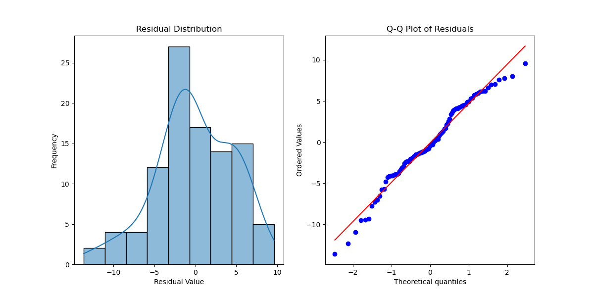

# Model Residuals in Time Series Analysis

Model residuals tell the story of what a forecasting model missed. A solid residual analysis helps validate the model and reveals areas for improvement. This chapter breaks down how to analyze forecast residuals effectively.

# Understanding Residuals in Time Series

Residuals are the gaps between what the model predicts and what actually happens. In a well-functioning time series model, these should behave like white noise --- random, uncorrelated, and normally distributed. If they don't, there's room to refine the model.

# Python Implementation to Analyze Residuals

``` {.python language="Python" caption="Python Code for Residual Analysis"}

import seaborn as sns
from scipy import stats
from statsmodels.tsa.stattools import acf
from statsmodels.graphics.gofplots import ProbPlot

class ResidualAnalyzer:
    """
    A toolkit for analyzing residuals.
    """
    def __init__(self, actual_values, predicted_values):
        self.actual = np.array(actual_values)
        self.predicted = np.array(predicted_values)
        self.residuals = self.actual - self.predicted

    def basic_statistics(self):
        """
        Get key stats on residuals.
        """
        stats_dict = {
            'Mean': np.mean(self.residuals),
            'Std Dev': np.std(self.residuals),
            'Skewness': stats.skew(self.residuals),
            'Kurtosis': stats.kurtosis(self.residuals),
            'Min': np.min(self.residuals),
            'Max': np.max(self.residuals)
        }
        return pd.Series(stats_dict)

    def plot_residual_distribution(self):
        """
        Show how residuals are distributed.
        """
        plt.figure(figsize=(12, 6))

        plt.subplot(1, 2, 1)
        sns.histplot(self.residuals, kde=True)
        plt.title('Residual Distribution')
        plt.xlabel('Residual Value')
        plt.ylabel('Frequency')
        plt.savefig("residual_distribution.png")

        plt.subplot(1, 2, 2)
        stats.probplot(self.residuals, dist="norm", plot=plt)
        plt.title('Q-Q Plot of Residuals')
        plt.savefig("qq_plot.png")

        plt.tight_layout()
        plt.show()
```

# What These Graphs Show

A histogram and density plot show how residuals are distributed. A symmetric, bell-shaped curve suggests normality. Deviations hint at skewness or heavy tails.  A Q-Q plot compares the residual distribution to a normal distribution. If residuals fall along the diagonal line, they follow a normal distribution. Deviations suggest non-normality, which can affect statistical assumptions.

An autocorrelation function (ACF) plot checks whether residuals are correlated with past values. Bars within the confidence interval indicate randomness. Bars extending beyond suggest autocorrelation, meaning the model hasn't captured all time-dependent patterns.


# Making Sense of Residuals

Before trusting statistical tests, always check residual plots. If residuals form patterns over time, the model might be missing important features. Autocorrelation is another issue --- if residuals correlate across time, the model hasn't fully accounted for the time series structure. If strong patterns exist, consider modifying the model or applying transformations.

# Red Flags in Residuals

Heteroskedasticity occurs when residual variance changes over time. This suggests instability in predictions. Systematic patterns in residuals indicate missing seasonality or external influences. Autocorrelation means past residuals influence current ones. This signals that the model hasn't fully captured the time dynamics. Non-normal residuals suggest the model assumptions may be incorrect. Outliers indicate rare events or data issues.

# Why Residuals Matter

A model isn't just about hitting close predictions --- it's about understanding where it goes wrong. Residual analysis helps identify blind spots, ensuring the model captures all essential patterns. By combining statistical tests, visualizations, and domain knowledge, you can refine your models for better, more trustworthy forecasts.

# Identifying and Correcting for Serial Correlation in Dynamic Models for Time Series

Dynamic models in time series often exhibit serial correlation, a condition where error terms are correlated across time. Serial correlation violates the classical assumption of independent errors, leading to inefficient estimates, incorrect standard errors, and misleading statistical inferences.

Serial correlation, also known as autocorrelation, occurs when the residuals ($\epsilon_t$) of a regression model are correlated with past residuals ($\epsilon_{t-1}, \epsilon_{t-2}, \ldots$). In dynamic models, where past values of variables influence the present, serial correlation is a common issue.

# The Presence of Serial Correlation

The presence of serial correlation means that:

$$\text{where:}$$ $$\epsilon_t \text{ is the error term at time } t.$$ $$k \text{ is the lag order.}$$

If $\rho > 0$, we have positive serial correlation (errors move together in the same direction). If $\rho < 0$, we have negative serial correlation (errors alternate in sign).

If serial correlation exists in a dynamic model, then the standard errors are biased. This leads to misleading statistical tests. It also means we violate the assumptions of Ordinary Least Squares (OLS) (aka regression), and the confidence intervals and hypothesis tests are unreliable. As a result, any forecasts made with this model are less accurate and prone to propagate errors into future predictions (i.e., bad outcomes).

# Detecting Serial Correlation

There are several methods to test for serial correlation in residuals:

- Durbin-Watson Test: A simple statistic for first-order autocorrelation.

- Breusch-Godfrey Test: A more general test that detects autocorrelation at higher lags.

- Autocorrelation Function (ACF): Plots correlations between residuals over different time lags.

Let's examine serial correlation in a distributed lag model using data from FRED: University of Michigan: Inflation Expectation (MICH).

Function to fetch data from FRED:
import statsmodels.api as sm import statsmodels.graphics.tsaplots as tsaplots from statsmodels.stats.diagnostic import acorr\_breusch\_godfrey from statsmodels.regression.linear\_model import GLS, GLSAR from datetime import datetime from pandas\_datareader import data as web import matplotlib.pyplot as plt from visualization import plot\_time\_series, plot\_decomposition} def get_fred_data(series_id, start_date="2000-01-01", end_date=None): if end_date is None: end_date = datetime.now().strftime("%Y-%m-%d") df = web.DataReader(series_id, 'fred', start_date, end_date) return df.dropna()

Fetch University of Michigan Consumer Sentiment Index (MICH):
series_id = "MICH" mich_data = get_fred_data(series_id) mich_data = mich_data.pct_change().dropna() # Convert to percentage change

Prepare DataFrame:
mich_data = mich_data.rename(columns={series_id: "MICH"}) mich_data["Date"] = mich_data.index # Ensure a date column for plotting

Create lagged MICH values:
for lag in range(1, 3): # Include 2 lags mich_data[f"MICH_lag{lag}"] = mich_data["MICH"].shift(lag)

Drop missing values due to lagging:
mich_data.dropna(inplace=True)

Define independent and dependent variables:
X_lags = ["MICH", "MICH_lag1", "MICH_lag2"] X_matrix = sm.add_constant(mich_data[X_lags]) # Add intercept y_vector = mich_data["MICH"] # Target is MICH itself (can be changed)

Fit a distributed lag model:
model = sm.OLS(y_vector, X_matrix).fit()

Perform the Breusch-Godfrey test for serial correlation:
bg_test = acorr_breusch_godfrey(model, nlags=2) print(f"Breusch-Godfrey Test p-value: {bg_test[1]:.4f}")

Breusch-Godfrey Test (p-value = 0.0000) test checks for serial correlation in the residuals. A p-value of 0.0000 rejects the null hypothesis of no serial correlation. So we conclude that the residuals exhibit autocorrelation, suggesting that the model's errors are not independent.

# Addressing Serial Correlation

If serial correlation is detected, there are several ways to correct it:

## Generalized Least Squares (GLS)

GLS modifies OLS by accounting for the structure of the serial correlation:

gls_model = GLS(y_vector, X_matrix).fit() print(gls_model.summary())

GLS (Generalized Least Squares) model shows MICH coefficient = 1.0000 with a t-statistic of  0. MICH_lag1 and MICH_lag2 have near-zero effects, with high p-values. R² = 1.000, suggesting a perfect fit (which is highly suspicious). The Durbin-Watson statistic = 2.392, close to 2, indicating some correction of autocorrelation.

## Cochrane-Orcutt Method

The Cochrane-Orcutt method uses an iterative procedure to transform the regression model to eliminate serial correlation:

cochrane_orcutt = GLSAR(y_vector, X_matrix, rho=1).iterative_fit() print(cochrane_orcutt.summary())

GLSAR (Cochrane-Orcutt) shows MICH coefficient remains 1.0000 which confirms a near-perfect correlation. MICH_lag1 and MICH_lag2 now become significant (p \< 0.05), suggesting they add some explanatory power. The Durbin-Watson statistic = 1.533, still indicating some autocorrelation but improved from the GLS model.

## Newey-West Standard Errors

Newey-West Robust Standard Errors provide valid inference if we can't correct the model structure:

model_robust = model.get_robustcov_results(cov_type="HAC", maxlags=2) print(model_robust.summary())

Newey-West (aka OLS with HAC) adjusts standard errors for autocorrelation and heteroscedasticity. Surprisingly, the coefficients remain nearly unchanged. MICH_lag1 and MICH_lag2 remain insignificant, suggesting they are not contributing much explanatory power. The Durbin-Watson = 2.392, close to 2, indicating some reduction in autocorrelation.

## Autocorrelation Function (ACF)

To diagnose serial correlation, we can plot the Autocorrelation Function (ACF) of the residuals:

import statsmodels.graphics.tsaplots as tsaplots
    # Extract residuals
residuals = model.resid
    # Plot ACF
plt.figure(figsize=(10, 5)) tsaplots.plot_acf(residuals, lags=20, alpha=0.05) plt.xlabel("Lag") plt.ylabel("Autocorrelation") plt.title("Autocorrelation of Residuals") plt.savefig("residual_acf.png") plt.show()

Autocorrelation Function (ACF) Plot confirms serial correlation. The spike at lag 1 indicates strong autocorrelation. Most of the other lags remain within the confidence bands, meaning the issue is primarily at lower lags. The plot supports the Breusch-Godfrey test result.

In this case, we conclude that there is serial correlation (confirmed by the Breusch-Godfrey test (p = 0.0000) and the ACF plot). The GLS and GLSAR models handle serial correlation better than OLS, as seen in the Durbin-Watson statistic. The University of Michigan Inflation Expectation is highly autocorrelated, with lags contributing little. We could improve this analysis by looking at differencing models or using tools like ARIMA.

Serial correlation is a common problem in dynamic models, particularly those involving lagged predictors. If ignored, it leads to inefficient estimates and misleading inference. The Breusch-Godfrey test helps detect it, while GLS, Cochrane-Orcutt, and Newey-West corrections help address it.

## Key Takeaways

- Durbin-Watson Test: A simple statistic for first-order autocorrelation.
- Breusch-Godfrey Test: A more general test that detects autocorrelation at higher lags.
- Autocorrelation Function (ACF): Plots correlations between residuals over different time lags.
